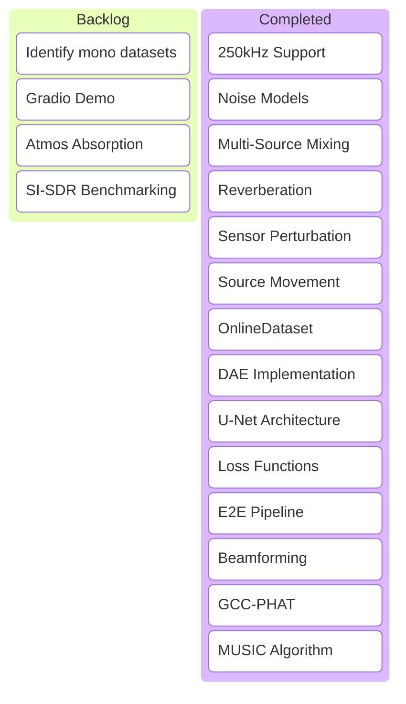

---

kanban-plugin: basic

---

## Visual Board



## Backlog

- [ ] Identify and download public mono datasets (e.g., Earth Species Project) for spatialization
- [ ] Develop interactive demo (Gradio) for multichannel file upload
- [ ] Investigate super-resolution techniques for TDOA estimation
- [ ] Implement Atmospheric Absorption (Frequency-dependent attenuation)


## Signal Pipeline

- [x] Update project_config.yaml with coordinate-based array geometry (x, y, z)
- [x] Implement DataMixer with physics-based delay simulation (Virtual Array)
- [x] Create geometry-based delay calculation logic (Steering Vectors)
- [x] Verify simulation physics (sine wave delay test)
- [x] Handle high sampling rates (up to 250kHz)
- [x] Implement Noise Models (White, Pink, Rain, Cocktail Party)
- [x] **Multi-Source Mixing:** Support arbitrary N sources.
- [x] **Reverberation:** Convolution with synthetic/real RIRs.
- [x] **Sensor Perturbation:** Random gain/phase mismatch per channel.
- [x] **Source Movement:** Trajectory-based delays.


## Modeling

- [x] **Create PyTorch `OnlineDataset` for on-the-fly augmentation**
- [x] **Implement Denoising Autoencoder (DAE) for initial noise reduction**
- [x] **Setup training loop with YAML config**
- [x] **Reimplement BioCPPNet U-Net architecture**
- [x] **Implement Loss Functions (L1, STFT, SC)**
- [x] Integrate End-to-End Pipeline (Beamformer + DAE + U-Net)


## Array Processing

- [x] Implement Delay-and-Sum Beamforming
- [x] **Implement Sub-sample Delay Estimation (GCC-PHAT + Interpolation)**
- [x] Implement MUSIC algorithm for DoA estimation
- [x] Integrate beamformed signal as input to BioCPPNet


## Results

- [ ] SI-SDR Benchmarking
- [ ] Downstream classification accuracy evaluation
- [ ] Documentation and Obsidian export


***

## Archive

- [x] Initial Project Setup
- [x] Add unit tests for STFT inversions and beamforming delays
- [x] Add comprehensive 3D spatial unit tests (azimuth & elevation)

%% kanban:settings
```
{"kanban-plugin":"basic"}
```
%%
