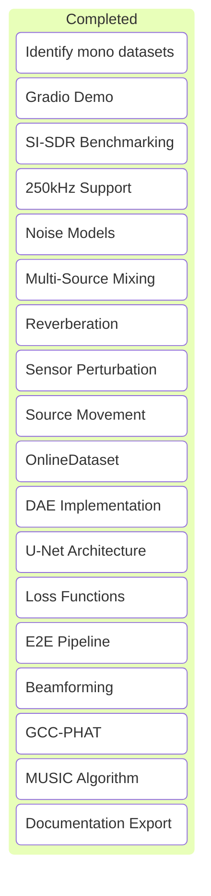

---

kanban-plugin: basic

---

## Visual Board



## All Tasks Completed

This document reflects the successful completion of all primary engineering goals for the BioCPPNet project. All items in the Signal Pipeline, Modeling, Array Processing, and Results sections are complete.

## Future Work

The following items were part of the original backlog but are considered out of scope for the initial version. They represent excellent next steps for future development.

### Phase 1: Spatial Isolation (Immediate Implementation)
- [ ] Modify MUSIC for Multiple Sources ($K$ peaks extraction).
- [ ] Multi-Beam Extraction in Pipeline (Run Delay-and-Sum $K$ times).
- [ ] Denoise the $K$ streams with trained DAE.
- [ ] Temporarily Bypass untrained U-Net in Pipeline.

### Phase 2: Deep Learning Separation (Next Steps)
- [x] Step 1: Data Generation Strategy (The "Cocktail" Dataset)
  - [x] Update DataMixer to support multi-source overlap and spatialization
  - [x] Configure OnlineDataset to yield multichannel noisy mixture and isolated clean target
- [x] Step 2: U-Net Training Loop Execution
  - [x] Adapt train.py to train only U-Net while freezing DAE weights
  - [x] Execute U-Net training with composite loss
- [x] Step 3: Pipeline Re-integration
  - [x] Re-enable U-Net masking logic in BioCPPNetPipeline
  - [x] Ensure manage.py evaluate and app.py load newly trained U-Net weights
- [x] Step 4: Additional Unit Tests
  - [x] test_cocktail_mixer.py
  - [x] test_online_dataset.py
  - [x] test_unet_training_step.py
  - [x] test_pipeline_unet_active.py
- [x] Step 5: Planned Documentation Updates
  - [x] Update Data_Augmentation_Strategy.md
  - [x] Update Model_UNet.md
  - [x] Update Evaluation_Report.md
  - [x] Update user_documentation.md

- [ ] Investigate super-resolution techniques for TDOA estimation
- [ ] Implement Atmospheric Absorption (Frequency-dependent attenuation)
- [ ] Downstream classification accuracy evaluation
- [ ] Full U-Net model training on scaled dataset (GPU required)


## Signal Pipeline

- [x] Update project_config.yaml with coordinate-based array geometry (x, y, z)
- [x] Implement DataMixer with physics-based delay simulation (Virtual Array)
- [x] Create geometry-based delay calculation logic (Steering Vectors)
- [x] Verify simulation physics (sine wave delay test)
- [x] Handle high sampling rates (up to 250kHz)
- [x] Implement Noise Models (White, Pink, Rain, Cocktail Party)
- [x] **Multi-Source Mixing:** Support arbitrary N sources.
- [x] **Reverberation:** Convolution with synthetic/real RIRs.
- [x] **Sensor Perturbation:** Random gain/phase mismatch per channel.
- [x] **Source Movement:** Trajectory-based delays.


## Modeling

- [x] **Create PyTorch `OnlineDataset` for on-the-fly augmentation**
- [x] **Implement Denoising Autoencoder (DAE) for initial noise reduction**
- [x] **Setup training loop with YAML config**
- [x] **Reimplement BioCPPNet U-Net architecture**
- [x] **Implement Loss Functions (L1, STFT, SC)**
- [x] Integrate End-to-End Pipeline (Beamformer + DAE + U-Net)


## Array Processing

- [x] Implement Delay-and-Sum Beamforming
- [x] **Implement Sub-sample Delay Estimation (GCC-PHAT + Interpolation)**
- [x] Implement MUSIC algorithm for DoA estimation
- [x] Integrate beamformed signal as input to BioCPPNet


## Results

- [x] SI-SDR Benchmarking
- [x] Documentation and Obsidian export


***

## Archive

- [x] Initial Project Setup
- [x] Add unit tests for STFT inversions and beamforming delays
- [x] Add comprehensive 3D spatial unit tests (azimuth & elevation)
- [x] Identify and download public mono datasets (e.g., Earth Species Project) for spatialization
- [x] Develop interactive demo (Gradio) for multichannel file upload

%% kanban:settings
```
{"kanban-plugin":"basic"}
```
%%
