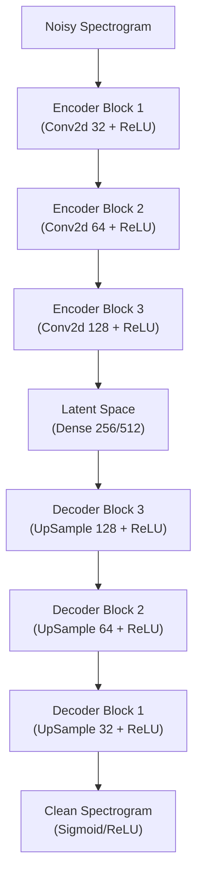

# Denoising Autoencoder (DAE) Architecture

The **Denoising Autoencoder (DAE)** is a pre-processing module designed to remove environmental noise (e.g., wind, rain) from the audio stream before it enters the source separation U-Net.

## High-Level Design

-   **Architecture Type:** Convolutional Autoencoder (Bottleneck structure).
-   **Goal:** Learn a compact representation of "clean bioacoustic signals" and reconstruct them from noisy inputs.
-   **Domain:** Magnitude Spectrogram.

## Architecture Diagram

## Architectural Details

### 1. Encoder (Compression)
The encoder reduces the dimensionality of the input spectrogram, forcing the model to discard high-frequency noise and irrelevant details.

*   **Layer 1:**
    *   Conv2d (32 filters, 3x3 kernel, stride=2, padding=1)
    *   Activation: ReLU
*   **Layer 2:**
    *   Conv2d (64 filters, 3x3 kernel, stride=2, padding=1)
    *   Activation: ReLU
*   **Layer 3:**
    *   Conv2d (128 filters, 3x3 kernel, stride=2, padding=1)
    *   Activation: ReLU

### 2. Bottleneck (Latent Space)
The most compressed representation of the signal.
*   **Layer:**
    *   Dense (Linear) -> Reshape
    *   *Size:* 256 or 512 units (representing ~1 sec of audio).

### 3. Decoder (Reconstruction)
The decoder reconstructs the clean spectrogram from the bottleneck features.

*   **Layer 3 (Upsample):**
    *   ConvTranspose2d (128 filters, 3x3 kernel, stride=2, padding=1)
    *   Activation: ReLU
*   **Layer 2 (Upsample):**
    *   ConvTranspose2d (64 filters, 3x3 kernel, stride=2, padding=1)
    *   Activation: ReLU
*   **Layer 1 (Upsample):**
    *   ConvTranspose2d (32 filters, 3x3 kernel, stride=2, padding=1)
    *   Activation: ReLU

### 4. Output Layer
Reconstructs the original spectrogram dimensions.
*   **Layer:** ConvTranspose2d (1 filter, 3x3 kernel, stride=1, padding=1)
*   **Activation:** Sigmoid (if normalized 0-1) or ReLU (if magnitude).

## Training Strategy

### Data Augmentation
The model is trained by artificially corrupting clean signals with:
1.  **Gaussian White Noise (AWGN):** Simulates sensor thermal noise.
2.  **Pink/Brown Noise:** Simulates wind.
3.  **Impulsive Noise:** Simulates rain drops.

### Loss Function
**Mean Squared Error (MSE):**
$$ L = \frac{1}{N} \sum (S_{clean} - S_{reconstructed})^2 $$
*Simple pixel-wise difference between the clean and reconstructed spectrograms.*

## Integration
This model acts as a "filter" block:
`Noisy Audio -> STFT -> DAE -> Clean STFT -> BioCPPNet -> Separated Sources`
