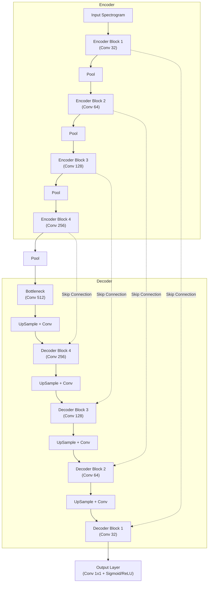

# BioCPPNet U-Net Architecture

The **BioCPPNet U-Net** is the core deep learning model responsible for source separation. It is designed to disentangle overlapping bioacoustic vocalizations from multichannel or single-channel inputs.

## High-Level Design

-   **Architecture Type:** Convolutional U-Net (Encoder-Decoder with Skip Connections).
-   **Domain:** Time-Frequency (Spectrogram).
-   **Input:** Magnitude Spectrogram of the mixed/noisy signal.
-   **Output:** Estimated Magnitude Spectrogram of the target source (or a soft mask).

## Architecture Diagram

## Architectural Details

### 1. Input Layer
-   **Shape:** `(Batch, Channels, FreqBins, TimeFrames)`
    -   *Channels:* 1 (Mono processing) or $N$ (Multichannel early fusion).
    -   *FreqBins:* 513 (for `n_fft=1024`).
    -   *TimeFrames:* Variable (e.g., 256 or 512 frames for ~1 second of audio).

### 2. Encoder (Contracting Path)
The encoder extracts hierarchical features and reduces the spatial resolution (downsampling).

*   **Block 1:**
    *   Conv2d (kernel=3x3, stride=1, padding=1) -> BN -> LeakyReLU
    *   Conv2d (kernel=3x3, stride=1, padding=1) -> BN -> LeakyReLU
    *   MaxPool2d (kernel=2x2)
*   **Block 2:**
    *   Double Conv2d (Filters x 2)
    *   MaxPool2d
*   **Block 3:**
    *   Double Conv2d (Filters x 4)
    *   MaxPool2d
*   **Block 4:**
    *   Double Conv2d (Filters x 8)
    *   MaxPool2d

### 3. Bottleneck
The deepest layer capturing the most abstract features.
*   Double Conv2d (Filters x 16)
*   *Note:* No pooling here.

### 4. Decoder (Expanding Path)
The decoder reconstructs the signal resolution. Skip connections concatenate features from the Encoder to preserve spatial details (time/frequency alignment).
**Note:** Uses `Bilinear Upsample` + `Conv2d` instead of `ConvTranspose2d` to avoid checkerboard artifacts.

*   **Up-Block 4:**
    *   Upsample (Scale 2) + Conv2d
    *   Concatenate with Encoder Block 4 Output
    *   Double Conv2d
*   **Up-Block 3:**
    *   Upsample (Scale 2) + Conv2d
    *   Concatenate with Encoder Block 3 Output
    *   Double Conv2d
*   **Up-Block 2:**
    *   Upsample (Scale 2) + Conv2d
    *   Concatenate with Encoder Block 2 Output
    *   Double Conv2d
*   **Up-Block 1:**
    *   Upsample (Scale 2) + Conv2d
    *   Concatenate with Encoder Block 1 Output
    *   Double Conv2d

### 5. Output Head
*   **Layer:** Conv2d (1x1 kernel)
*   **Activation:**
    *   `Sigmoid`: If estimating a Mask (values 0-1).
    *   `ReLU`: If estimating Magnitude directly (values >= 0).

## Loss Functions
The model is trained using a multi-objective loss function to ensure spectral fidelity and waveform consistency.

1.  **L1 Waveform Loss:**
    $$ L_{time} = || x_{target} - \hat{x}_{est} ||_1 $$
    *Requires Inverse STFT (ISTFT) during training.*

2.  **STFT Magnitude Loss:**
    $$ L_{mag} = || |STFT(x)| - |STFT(\hat{x})| ||_1 $$
    *Ensures the spectrogram looks correct.*

3.  **Spectral Convergence Loss:**
    $$ L_{sc} = \frac{|| |STFT(x)| - |STFT(\hat{x})| ||_F}{|| |STFT(x)| ||_F} $$
    *Emphasizes high-energy components (Frobenius norm).*

## Hyperparameters (Default)
-   **Input Channels:** 1
-   **Base Filters:** 16 or 32
-   **Depth:** 4 or 5 levels
-   **Optimizer:** Adam (`lr=1e-4`)

## Phase 2: Training Strategy
During the final "Phase 2" integration, the U-Net is trained within the context of the full end-to-end pipeline:
1.  **Frozen Pre-processor:** The Denoising Autoencoder (DAE) weights are frozen (`requires_grad=False`) during U-Net training, ensuring the U-Net learns to operate on pre-denoised spectrograms.
2.  **Spatial Input:** The U-Net receives a signal that has already been spatially focused (beamformed) towards the target azimuth.
3.  **Task:** The U-Net's job is purely non-linear source separation—subtracting overlapping bioacoustic signals (interferers) that "leaked" through the spatial beamformer.
4.  **Target Function:** The model predicts a mask $\in [0, 1]$ which is element-wise multiplied with the DAE's output magnitude spectrogram. The loss is computed on the final reconstructed waveform.
