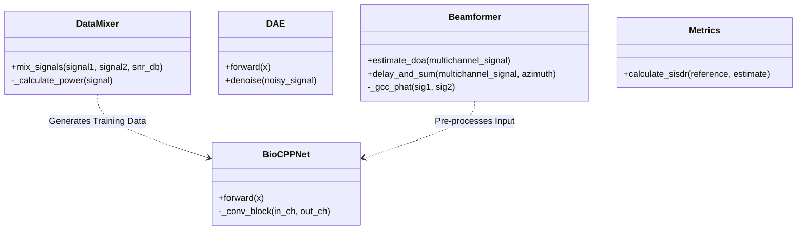

# BioCPPNet Architecture

## Goals
-   Source separation of overlapping bioacoustic signals.
-   Handling high-frequency sampling rates (250kHz).
-   Integration of spatial filtering (Beamforming) with deep learning (U-Net/DAE).

## System Overview

```mermaid
graph TD
    Data[Raw Audio Data] --> Mixer[DataMixer: Synthetic Mixing]
    Mixer --> Mixed[Mixed Audio]
    Mixed --> Beam[Beamformer: Spatial Filtering]
    Beam --> PreProcess[Denoising Autoencoder (DAE)]
    PreProcess --> Clean[Denoised Signal]
    Clean --> Model[BioCPPNet: U-Net Separation]
    Model --> Output[Isolated Sources]
    Output --> Metric[SI-SDR Metric]
    Clean --> Metric
```

## Python Module Diagram



## Directory Structure

```text
BioaccousticCPP/
├── data/                  # Raw and processed audio data
├── docs/                  # Project documentation & Kanban board
│   └── BioCPPNet/         # Obsidian Vault
│       ├── .obsidian/
│       ├── architecture.md
│       ├── KANBAN.md
│       ├── Welcome.md
│       └── Signal_Specification.md
├── results/               # General project output and results
├── src/                   # Source code
│   ├── models/            # Deep Learning Models
│   │   ├── unet.py
│   │   └── dae.py     # Denoising Autoencoder
│   ├── spatial/           # Spatial Audio Processing
│   │   └── beamforming.py
│   ├── metrics/           # Evaluation Metrics
│   │   └── sisdr.py
│   ├── data_mixer.py      # Data Augmentation/Mixing
│   ├── utils.py           # Logging & Plotting
│   └── main.py            # Main entry point
├── tests/                 # Unit tests
├── unit test results/     # Test execution reports
├── docker-compose.yml     # Docker services
├── Dockerfile             # Container definition
├── manage.py              # CLI management tool
├── project_config.yaml    # Configuration
├── pyproject.toml         # Python project metadata
└── requirements.txt       # Dependencies
```

## Components

### 1. Data Pipeline (`src/data_mixer.py`)
-   **Input:** Isolated vocalizations (WAV).
-   **Process:** Synthetic mixing at various SNRs.
-   **Output:** Mixed WAV files + ground truth.

### 2. Core Models
-   **BioCPPNet (`src/models/unet.py`):** U-Net architecture for source separation.
-   **Denoising Autoencoder (`src/models/dae.py`):** Optional pre-processing stage for noise reduction.

### 3. Spatial Processing (`src/spatial/beamforming.py`)
-   **Algorithm:** MUSIC for DoA estimation.
-   **Beamforming:** Delay-and-Sum.
-   **Resolution Enhancement:** Sub-sample delay estimation using GCC-PHAT and parabolic interpolation.
-   **Hardware:** 16-channel array (simulated or miniDSP UMA-16).

### 4. Validation (`src/metrics/sisdr.py`)
-   **Metric:** Scale-Invariant Signal-to-Distortion Ratio (SI-SDR).
-   **Downstream:** Classification accuracy.

## Configuration
-   Managed via `project_config.yaml`.
