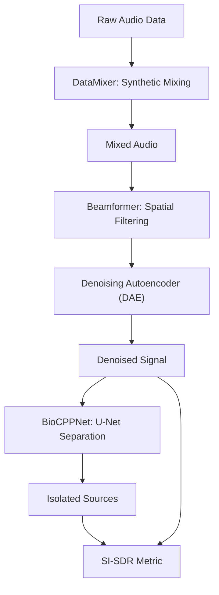
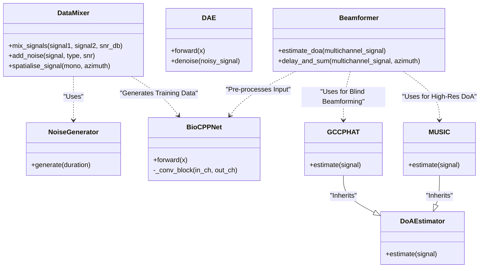

# BioCPPNet Architecture

## Goals
-   Source separation of overlapping bioacoustic signals.
-   Handling high-frequency sampling rates (250kHz).
-   Integration of spatial filtering (Beamforming) with deep learning (U-Net/DAE).

## System Overview



## Python Module Diagram



## Directory Structure

```text
BioaccousticCPP/
├── data/                  # Raw and processed audio data
├── docs/                  # Project documentation & Kanban board
│   └── BioCPPNet/         # Obsidian Vault
├── results/               # General project output
├── src/                   # Source code
│   ├── models/            # Deep Learning Models
│   │   ├── dae.py         # Denoising Autoencoder
│   │   ├── unet.py        # U-Net Source Separation
│   │   └── losses.py      # Loss Functions (L1, STFT, SC)
│   ├── spatial/           # Spatial Audio (Beamforming/Physics)
│   │   ├── beamforming.py # Delay-and-Sum
│   │   ├── physics.py     # Core Physics (Steering Vectors)
│   │   ├── reverb.py      # RIR Generation
│   │   └── estimators.py  # GCC-PHAT / DoA Estimators / MUSIC
│   ├── metrics/           # Evaluation Metrics
│   ├── data_mixer.py      # Data Augmentation/Mixing
│   ├── data_loader.py     # PyTorch Dataset
│   ├── noise_models.py    # Noise Generators (White, Pink, Rain)
│   ├── pipeline.py        # End-to-End Pipeline
│   ├── utils.py           # Logging & Plotting
│   ├── train.py           # Training Loop
│   └── main.py            # Main entry point / Integration Test
├── tests/                 # Unit tests
│   ├── test_music.py      # MUSIC Algorithm tests
│   └── ...
├── unit test results/     # Test execution reports
│   └── session_TIMESTAMP/ # Per-run output folder (plots/logs)
├── app.py                 # Gradio Interactive Demo
├── manage.py              # CLI management tool
├── record_av.ps1          # PowerShell script for A/V recording
└── project_config.yaml    # Configuration
```

## Components

### 1. Data Pipeline (`src/data_mixer.py`, `src/data_loader.py`)
-   **Input:** Isolated vocalizations (WAV).
-   **Process:** Synthetic mixing at various SNRs + Spatialization (Virtual Array) + Reverb + Noise.
-   **Noise Models:** White, Pink/Brown (Wind), Rain (Impulsive).
-   **Movement:** Trajectory-based dynamic delays for moving source simulation.
-   **Output:** Multichannel WAV files (Tensor batches).

### 2. Core Models
-   **[[Model_UNet|BioCPPNet U-Net]] (`src/models/unet.py`):** The main source separation model using composite loss (`src/models/losses.py`).
-   **[[Model_DAE|Denoising Autoencoder]] (`src/models/dae.py`):** Optional pre-processing stage for noise reduction.
-   **[[pipeline|End-to-End Pipeline]] (`src/pipeline.py`):** Integration module chaining Beamforming -> DAE -> U-Net.

### 3. Spatial Processing (`src/spatial/`)
-   **Algorithm:** [[Algorithm_GCC_PHAT|GCC-PHAT]] and [[Algorithm_MUSIC|MUSIC]] (`src/spatial/estimators.py`) for TDOA/DoA estimation.
-   **Beamforming:** Delay-and-Sum.
-   **Physics:** Sub-sample delay simulation via FFT phase shifting (static) or cubic interpolation (dynamic).
-   **Reverberation:** Stochastic RIR generation.
-   **Hardware:** 16-channel array (simulated or miniDSP UMA-16).

### 4. Validation (`src/metrics/sisdr.py`)
-   **Metric:** Scale-Invariant Signal-to-Distortion Ratio (SI-SDR).
-   **Downstream:** Classification accuracy.

## Configuration
-   Managed via `project_config.yaml`.
-   **Logging:** All logs and plots are timestamped per session to ensure reproducibility.
